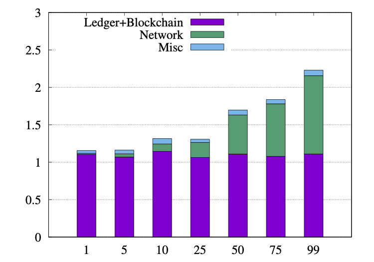

# Free2Shard_prism
Full stack uniconsensus sharding on prism rust codebase.

The experiments are run on 36-200 c5d.4xlarge instances. The experimental results show near linear scaling in throughput with increasing number of shards. We achieve horizontal+vertical sacling by running Free2shard in prism.

Setup instructions in testbed/readme.md

